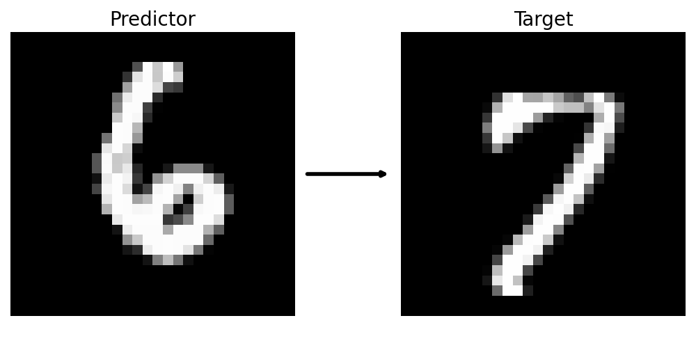

# PyTorch Image-to-Image Tutorial with MNIST

## Configuring Your Environment
Either use one of the two conda environment yamls or run the following pip command in your own environment:

```bash
pip install torch torchvision torchaudio accelerate lightning netCDF4 xarray matplotlib jupyterlab tqdm
```

## Defining Our Problem
The **MNIST** (Modified National Institute of Standards and Technology) dataset is a large collection of handwritten digits stored as 28x28 pixel greyscale images. This dataset is often used as a toy dataset for classification, answering the question "what digit is this?" Instead, we will be asking "What does the next digit look like?" That is, we want to create a mapping from an image of a digit to the image of a subsequent digit.
<div align="center">
  
</div>

## Getting Data

From **data/**, run **create_nc_MNIST.py** and then **MNIST_num2num_mapping.py**.

**create_nc_MNIST.py** creates a netCDF version of the MNIST dataset. PyTorch includes MNIST in a model-ingestable form -- the data is already a PyTorch tensor. We save this data as a netCDF file in order to explain how to load data in practice. **MNIST_num2num_mapping.py** then creates our mappings from a given digit to the next (modulo 10). These are assigned randomly. This means that our mappings are not necessarily injective; one image of a 6 may be mapped to multiple 7's.

## Tutorials

You can find annotated tutorial notebooks in **tutorials/**.

- **1.0_train_dense_nn.ipynb** : covers the basic PyTorch workflow to build a densely connected neural network with two hidden layers
    - **1.1_train_dense_nn_Accelerate.ipynb**: covers identical implementation using HuggingFace Accelerate
    - **1.2_train_dense_nn_Lightning.ipynb**: covers identical implementation using PyTorch Lightning
- **2.0_train_cnn_encoder.ipynb**: covers CNN encoder-decoder implementation
- **3.0_train_EDM_CorrDiff.ipynb**: covers generative prediction of residuals via Elucidated Diffusion Model (EDM)

You can run these tutorials in the cloud via Google Colab [here](https://colab.research.google.com/drive/13B5DNomYKQPctrwOJJXlpb39VUfoSvgO?usp=sharing). Make sure your runtime's hardware accelerator is set to a cuda-enabled GPU (Runtime > Change Runtime Type > Hardware Accelerator).

## License

All material is licensed under the [Creative Commons Attribution-NonCommercial-ShareAlike 4.0 International License](https://creativecommons.org/licenses/by-nc-sa/4.0/). All code in diffusion_utils.py is derived from the official [EDM repository](https://github.com/NVlabs/edm/tree/main) authored by Tero Karras, Miika Aittala, Timo Aila, and Samuli Laine. The architecture in unet_denoiser.py is derived from code shared by Charles "Chuck" White.